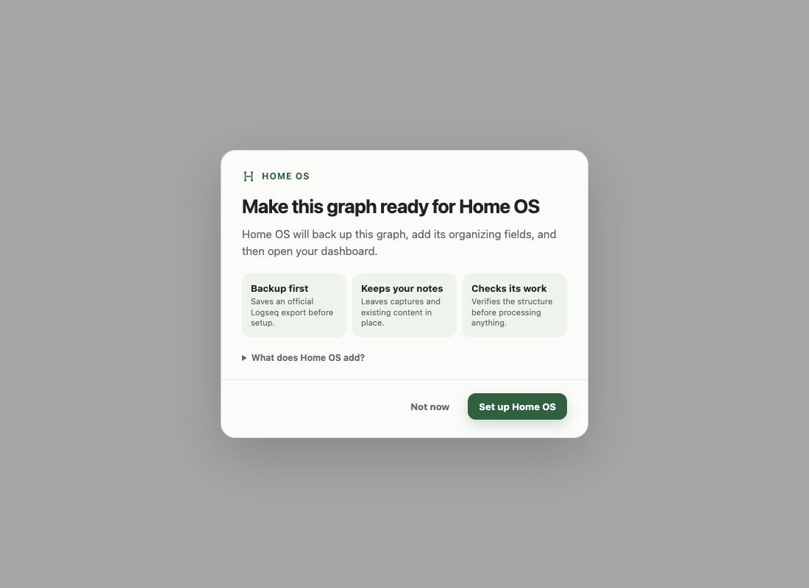
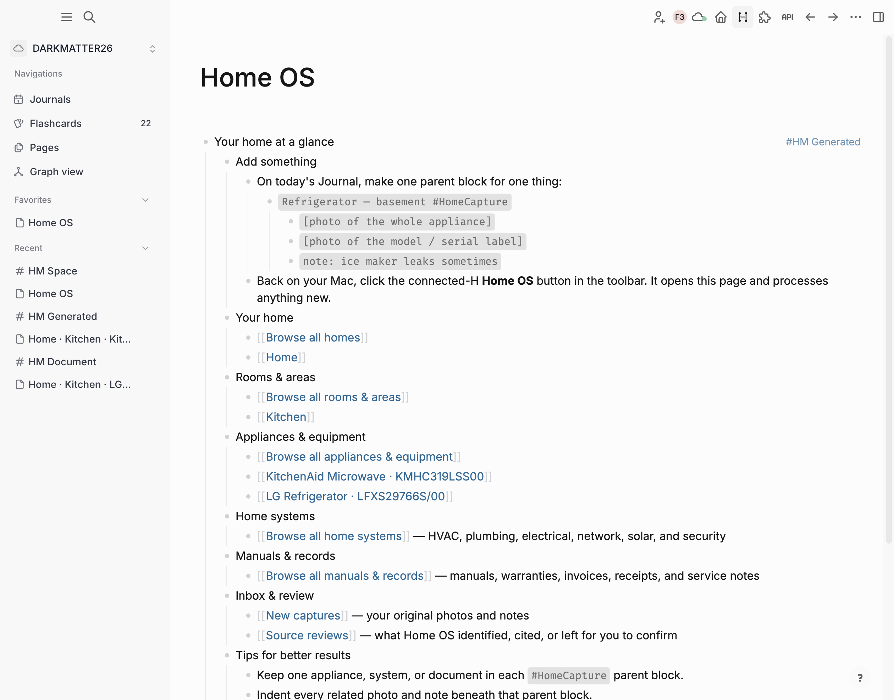
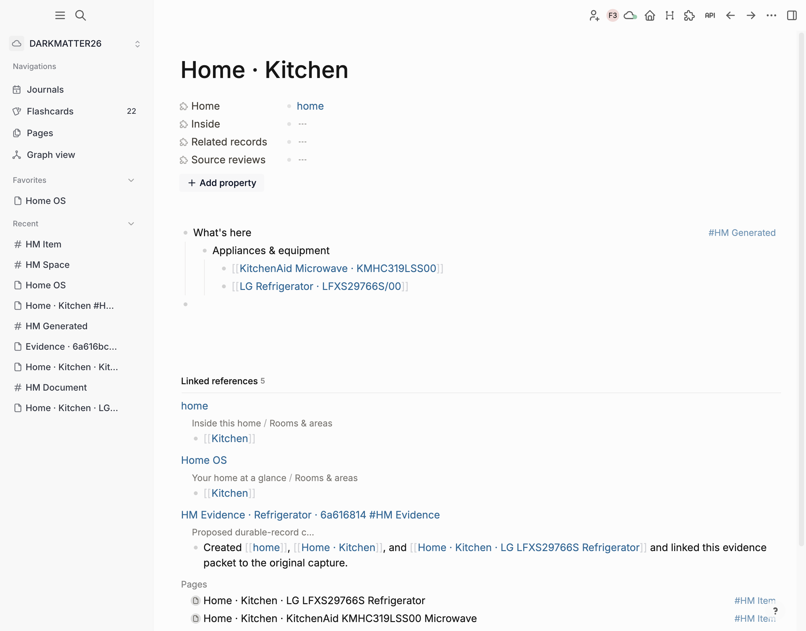
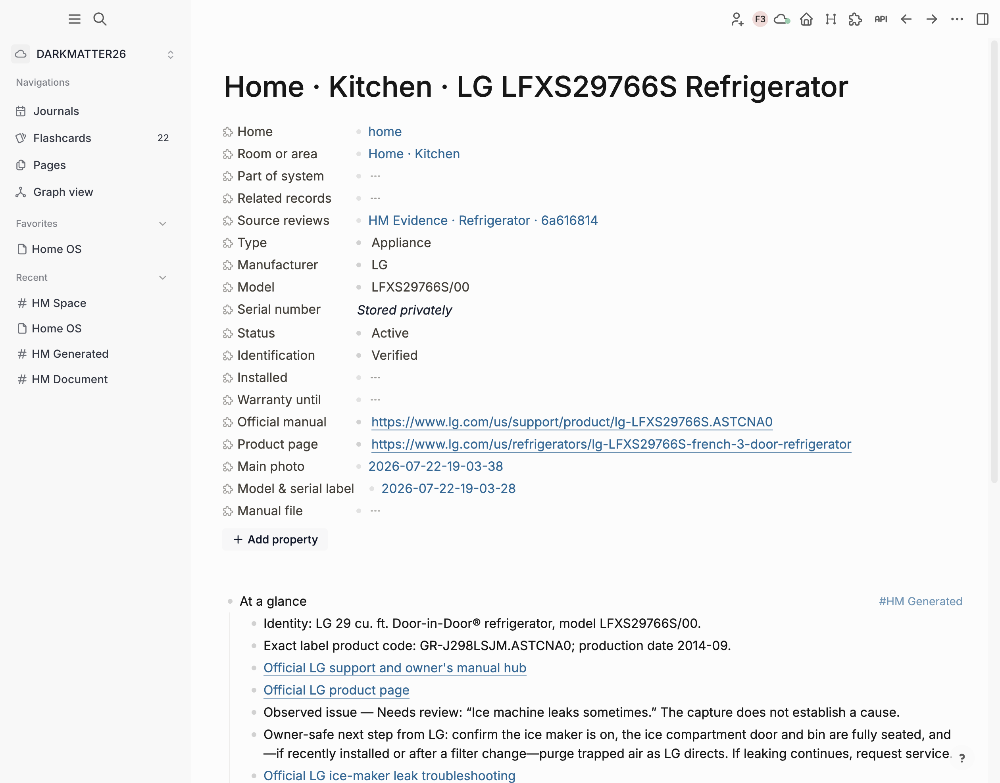
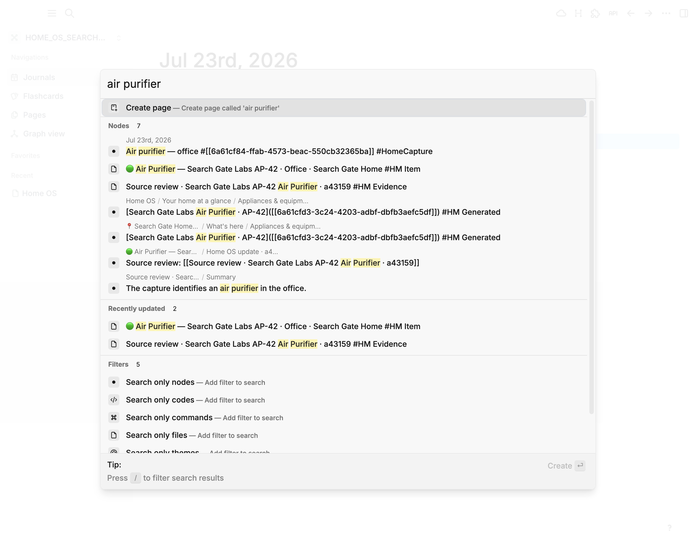

# Logseq Home OS

Turn one ordinary Logseq journal capture into a private, structured owner’s manual for your home.

```text
- Refrigerator — basement utility room #HomeCapture
  - [full-appliance photo]
  - [model/serial-label photo]
  - Ice maker leaks occasionally
```

Home OS preserves that source block, builds a versioned source review, and resolves it into durable Home, Room/Area, Home System, Appliance/Equipment, and Manual/Record pages. Logseq remains the operating surface; Codex does the bounded interpretation and source research.



The native `Home OS` page is the operating surface. It organizes actual records by type, links to Logseq's live tag tables, and keeps capture instructions beside the source inbox:



Room and area pages are useful destinations too. Typed relationships are projected into a short main-body outline; native linked references remain below as the provenance trail:



The same flow produced this real, linked appliance record from a three-child refrigerator capture while leaving the original block and photos intact:



Search is intentionally unambiguous: the canonical appliance or equipment
record starts with `🟢`. Search for an ordinary word such as `microwave`, then
open the green result. A room that mentions the microwave starts with `📍`;
captures, evidence, notes, and citations have no canonical type marker.



## What this repository contains

- A DB-graph-only Logseq plugin with one connected-H Home OS action, a native dashboard, guided first-run setup, and explicit processing feedback.
- A loopback-only, bearer-authenticated macOS bridge that semantically fingerprints changed captures before starting Codex.
- A Codex plugin/skill that enforces the additive evidence-to-record workflow.
- A narrow `materialize` contract that rejects stale fingerprints and unapproved schema values before writing.
- A first-class, privacy-sensitive `hm-serial` field on each Item record, with mandatory nameplate inspection, explicit captured/unavailable dispositions, conflict protection, and a value-free coverage audit.
- Relationship-driven main-body indexes for homes, rooms, systems, items, and documents; empty categories disappear and human-authored page content remains untouched.
- A single search affordance: `🟢` always marks the canonical appliance or equipment record, while `🏠`, `📍`, `⚙️`, and `📄` distinguish the other durable record types.
- Ownership and integrity gates that reject page collisions, multiple record kinds, parent-space cycles, home/location mismatches, unsafe URLs, and conflicting one-to-one relationships.
- A privacy audit plus ephemeral Codex transcripts: only sanitized, deduplicated machine receipts persist; crash recovery removes orphan transcripts/processes and runs have a hard timeout.
- Repeatable install, health, backup, verification, reinstall, and uninstall commands.

Home OS never deletes, moves, renames, or rewrites a `#HomeCapture` block or any child photo/note. Setup creates an official Logseq export before its first schema mutation.

## Zero-shot installation prompt

Open the latest Logseq 2.x DB desktop build, open the DB graph you want to use, then paste this into Codex:

```text
Install Logseq Home OS from https://github.com/AlienOctopus/logseq-home-os on this Mac.

Use only Logseq's official desktop HTTP API and the repository's supported installers. Do not edit SQLite, WAL, db-worker, search, or sync files. Keep the currently open Logseq DB graph as the target. Clone or update the repository in a normal user-owned source directory, add its Codex marketplace, install the home-os Codex plugin, run the bundled Home OS bootstrap against the currently open graph, and verify that the loopback bridge and Logseq plugin are installed. Do not create sample rooms or appliances and do not alter existing graph content.

When installation is healthy, tell me to click the Home OS dashboard action in Logseq. That first click must show the additive setup preview, create a backup, build and verify the graph structure, open the native Home OS dashboard, and automatically resume any waiting #HomeCapture. For every Item, inspect all nameplate photos at original resolution and always populate the private hm-serial field when the serial is legible; never place its value in logs, dashboard text, QR content, or public summaries. Keep working through safe, reversible diagnostics until the complete install is verified; do not stop for routine confirmations.
```

The first dashboard click is the only setup surface the Logseq user needs. If the schema is missing or partially installed, the same action repairs it idempotently and resumes the original capture request. After setup, the connected-H glyph—four Logseq-like nodes forming an H—opens the `Home OS` page and checks the capture inbox. `Home OS: Process new captures` remains available in the command palette for power users who want to process without navigating.

Materialization is idempotent for an unchanged capture: a replay reuses the source review and durable record and does not add a second generated update.
Volatile Logseq timestamps and UI metadata do not requeue a capture, and a multi-capture run advances handled state only for UUIDs that return their own accepted machine receipt.

## Manual developer install

Requirements: macOS, Logseq 2.x DB graph open in desktop, Node.js 20+, and the Codex CLI bundled with ChatGPT/Codex desktop.

```bash
git clone https://github.com/AlienOctopus/logseq-home-os.git
cd logseq-home-os
codex plugin marketplace add AlienOctopus/logseq-home-os
codex plugin add home-os@zero-shot-or-die
node skills/logseq-home-os/scripts/home-os.mjs bootstrap
```

Then reload **Home OS Capture** from Logseq’s Plugins screen once during local development. Use the connected-H action or **Home OS: Open dashboard** to open the operating surface and check the inbox. Use **Home OS: Process new captures** from the command palette to process without changing pages.

Health and verification:

```bash
node skills/logseq-home-os/scripts/home-os.mjs doctor
node skills/logseq-home-os/scripts/home-os.mjs schema-plan
node skills/logseq-home-os/scripts/home-os.mjs schema-verify
node skills/logseq-home-os/scripts/home-os.mjs dashboard
node skills/logseq-home-os/scripts/home-os.mjs canonical-title-audit
node skills/logseq-home-os/scripts/home-os.mjs serial-audit
node skills/logseq-home-os/scripts/home-os.mjs record-audit
node skills/logseq-home-os/scripts/home-os.mjs privacy-audit
node skills/logseq-home-os/scripts/home-os.mjs scan --changed-only
node skills/logseq-home-os/scripts/home-os.mjs self-test
```

## Reinstall and uninstall

Reinstall the local Logseq plugin and bridge without touching graph data, configuration, capture state, or backups:

```bash
node skills/logseq-home-os/scripts/home-os.mjs reinstall-local
```

Remove only the local Home OS runtime:

```bash
node skills/logseq-home-os/scripts/home-os.mjs uninstall-local --confirm remove-home-os-local-runtime
codex plugin remove home-os@zero-shot-or-die
```

Uninstall intentionally preserves all Logseq records, original captures, official exports, audit receipts, and Home OS local state.

## Publishing

The repository includes both distribution surfaces:

- Codex reads `.agents/plugins/marketplace.json`; consumers add the GitHub repository as a marketplace and install `home-os`.
- Logseq releases are built by `.github/workflows/publish.yml`. A release must contain the generated plugin zip, a clear README, and a screenshot before submitting `marketplace/logseq-home-os-capture/manifest.json` in a pull request to `logseq/marketplace`.

The Logseq manifest declares `supportsDBOnly: true`. The plugin uses the current DB SDK and is not designed for legacy file graphs.

The full adversarial acceptance matrix and final production invariants are in
[the v0.7.0 release gate](docs/release-gate-v0.7.0.md).

## Maintaining and extending

Coding agents and human contributors should begin with
[AGENTS.md](AGENTS.md). Claude Code also receives the same contract through
[CLAUDE.md](CLAUDE.md). The detailed architecture-to-release playbook is
[Maintaining and Extending Home OS](docs/maintaining-and-extending.md).

## Current beta boundary

Logseq 2.x nightlies currently expose a validator/UUID conversion mismatch for plugin-scoped native closed choices. Home OS therefore verifies six enumerated fields as documented value sets while keeping their names and semantics stable. All tags, inheritance, typed properties, node ranges, and tag-property attachments are native DB structure. No raw database workaround is used.

## License

MIT
